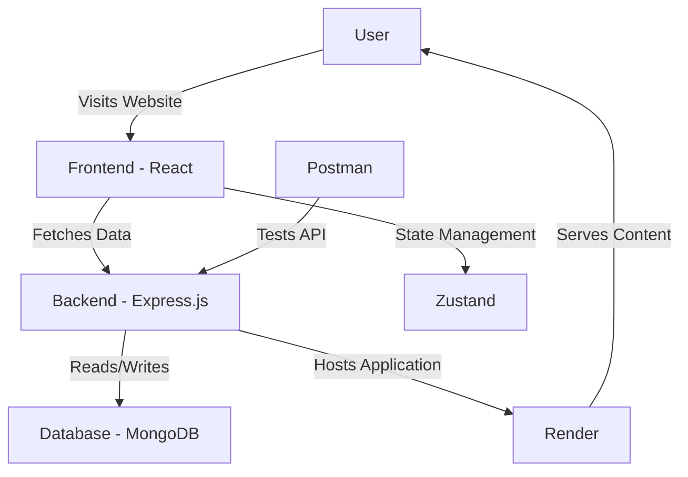

# My New Store

Welcome to **My New Store**, an online store project deployed on Render. This project demonstrates modern web development practices and is built using cutting-edge technologies to deliver a seamless shopping experience.

## Live Demo

You can access the live version of the project here:
[My New Store](https://my-new-store.onrender.com)

## Features

- **Responsive Design**: Optimized for desktops, tablets, and mobile devices.
- **User-Friendly Interface**: Intuitive navigation and clean layout.
- **Dynamic Content**: Engaging content powered by modern frameworks.
- **Deployment**: Hosted on Render for reliable performance.

## Tech Stack

This project leverages the following technologies:

- **Frontend**: React (with Zustand for state management)
- **Backend**: Express.js
- **Database**: MongoDB
- **Styling**: CSS and Bootstrap
- **API Testing**: Postman
- **Deployment**: Render

## Project Architecture Diagram



This diagram illustrates the flow of data and interactions in the project:

1. The user accesses the application via the browser.
2. The frontend (React) handles the user interface and communicates with the backend (Express.js).
3. The backend processes requests and interacts with the MongoDB database to fetch or store data.
4. Zustand manages application state for smooth user experience.
5. Postman is used to test and validate API endpoints.
6. The application is hosted on Render, ensuring consistent availability and performance.

## Installation and Setup

To run this project locally, follow these steps:

1. Clone the repository:

   ```bash
   git clone https://github.com/Nokiller103/my-new-store.git
   ```

2. Navigate to the project directory:

   ```bash
   cd my-new-store
   ```

3. Install dependencies:

   ```bash
   npm install
   ```

4. Set up MongoDB:

   - Ensure you [have MongoDB ](https://github.com/Nokiller103)installed and running locally or provide a connection string to a cloud MongoDB service.
   - Update the `.env` file with your MongoDB connection details.

5. Start the development server:

   ```bash
   npm start
   ```

6. Open your browser and navigate to `http://localhost:5000`.

## Deployment

This project is deployed on Render. To redeploy or update, follow these steps:

1. Push changes to the GitHub repository:

   ```bash
   git add .
   git commit -m "Update project"
   git push origin main
   ```

2. Log in to your Render dashboard.

3. Trigger a new build for your project.

## Contributing

Contributions are welcome! If you’d like to contribute to this project, please follow these steps:

1. Fork the repository.
2. Create a new branch:
   ```bash
   git checkout -b feature-name
   ```
3. Make your cha[nges and comm](https://github.com/Nokiller103)it them:
   ```bash
   git commit -m "Add new feature"
   ```
4. Push to the branch:
   ```bash
   git push origin feature-name
   ```
5. Open a pull request.

## License

This project is licensed under the MIT License. See the LICENSE file for more details.

## Contact

If you have any questions or suggestions, feel free to reach out:

- Email: [itsbiswadip1995@gmail.com]
- GitHub: [Nokiller103]

